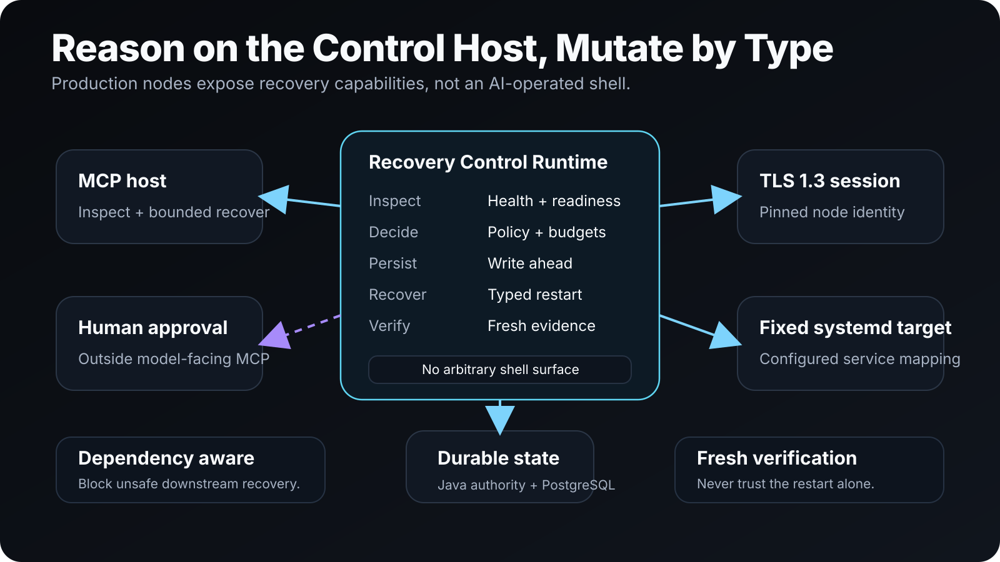

# Recovery Agent

**When a known service fails, Recovery Agent gathers evidence, performs one bounded typed recovery, and proves the service is healthy again.**

Recovery Agent is a control-host recovery runtime for Linux services. AI stays on the control host; production nodes expose only narrow typed health and recovery operations. MCP hosts can inspect incidents, run bounded recovery, create semantic watches, and review evidence without receiving arbitrary shell access or approval authority.

[Hackathon submission](HACKATHON_SUBMISSION.md) · [Demo runbook](DEMO_RUNBOOK.md) · [Architecture](docs/ARCHITECTURE.svg) · [Source](https://github.com/tjXJNOOBIE/Recovery-Agent)



## Why Recovery Agent

Small teams cannot watch every Linux service manually, but giving a model anonymous shell access to production is not a safe replacement for operations engineering.

Recovery Agent splits the problem into two layers:

- **deterministic control** owns targets, probes, restart budgets, write-ahead durability, mTLS transport, systemd mutation, verification, and audit;
- **Strands reasoning** handles bounded triage, specialist analysis, proposal planning, critique, and postmortems.

The model never gets a generic recovery shell and never owns human approval.

## What it does

Recovery Agent provides an end-to-end recovery control plane with:

- fleet, node, and service inspection;
- deterministic health sweeps and application probes;
- bounded typed `restart_service` recovery;
- Recovery Readiness classification;
- service, node, certificate, and deployment watches;
- natural-language semantic watch compilation into deterministic recurring schedules;
- dependency-aware rolling restart budgets;
- durable incidents, plans, watch definitions, deployment causality, and append-only audit history;
- outbound TLS 1.3 mutual-authenticated node transport;
- named local operator approval outside model-facing MCP;
- bounded Strands triage, specialist, synthesis, planner, critic, and postmortem roles.

## Runtime shape

```text
MCP host
  -> Recovery MCP server
      -> deterministic RecoveryControlRuntime
          -> fleet inspection + Recovery Readiness
          -> dependency gate + rolling restart budget
          -> write-ahead durability barrier
          -> typed node gateways
          -> deterministic watches
          -> semantic watch compiler
          -> bounded Strands triage / specialists / synthesis
          -> strict restart_service|none planner
          -> veto-only critic
          -> target-bound pending plan

control-host human
  -> recovery-agent approve/reject
      -> owner-only Unix socket
          -> named operator principal
          -> dependency re-check
          -> durable approval audit
          -> one already-bound typed action
          -> fresh verification
```

There is no normal arbitrary-shell recovery surface.

## Model-facing tools

The control host exposes a bounded MCP surface:

| Area | Tools |
| --- | --- |
| Fleet | `fleet_status`, `recovery_readiness`, `health_sweep` |
| Inspection | `node_inspect`, `service_inspect` |
| Recovery | `service_recover` |
| Watches | `watch_list`, `watch_run`, `watch_create`, `watch_update`, `watch_remove` |
| Incidents | `incident_list`, `incident_inspect`, `incident_postmortem` |
| Plans | `recovery_plan_list`, `recovery_plan_inspect` |

Approval and rejection are intentionally absent from model-facing MCP.

## Production node transport

Production nodes initiate outbound TLS 1.3 sessions to the control host.

- Mutual TLS authenticates both sides.
- The control host binds each declared node ID to an explicit SHA-256 client-certificate fingerprint allowlist.
- The node validates the control host through CA/hostname checks plus its own fingerprint allowlist.
- Node private keys must be regular files and privately owned by the Recovery process user.
- Credential rotation is overlap-based: allow old + new fingerprints, install replacement files, reconnect and verify, then retire the old fingerprint.
- `loopback_http` exists only for local compatibility and the explicitly simulated demo.

Remote/model callers cannot provide unit names, shell commands, application-health URLs, TLS targets, ports, or deployment marker paths. Those remain configured product state.

## Recovery safety

Recovery Agent treats mutation as a transaction with evidence.

```text
unhealthy target
  -> update incident / spend restart slot
  -> durable checkpoint
      -> failure: execute zero restart
      -> success: execute one typed restart
          -> fresh verification
          -> durable outcome checkpoint
```

Key invariants:

- same-target concurrent recovery shares one in-flight operation;
- approved and automatic recovery share the same per-target operation gate;
- unhealthy dependencies block downstream mutation and consume zero restart budget;
- pending approval suppresses duplicate automatic recovery/plans;
- every node mutation is followed by fresh deterministic verification;
- ambiguous execution is not blindly replayed after a crash;
- one unreachable node does not hide healthy fleet members;
- unresolved or in-doubt state is never pruned by retention;
- audit history is append-only under the durable schema.

## Durable control state

Durability is optional for local development and the restart-safe production path.

The TypeScript control runtime talks over strict newline-delimited stdio to a bundled Java 25 state authority built on Tavall Database and PostgreSQL. Durable state includes incidents, plans, rolling restart history, semantic watch definitions, audit history, node/certificate/deployment incidents, and deployment stabilization state.

Retention is domain-owned and opt-in. It may prune only fully terminal historical records while preserving unresolved state, current watch definitions, restart budgets, deployment causality, and the complete audit trail.

## Semantic watches

Operators can describe recurring recovery intent in natural language. Strands compiles that request **once** into an already-configured node/service target and a bounded interval. Recurring execution then calls the normal deterministic recovery path without further model calls.

The compiler cannot invent commands, URLs, ports, credentials, arbitrary actions, infrastructure, or unconfigured targets.

Built-in watch order is:

```text
node -> certificate -> deployment -> service recovery -> readiness
```

## Install

### Requirements

- Node.js 22+
- Java 25 when durable state is enabled
- PostgreSQL when durable state is enabled

Clone and build:

```bash
git clone https://github.com/tjXJNOOBIE/Recovery-Agent.git
cd Recovery-Agent
npm install
npm run build
```

Packaged npm artifacts include the Java state-authority launcher and runtime JARs, so an installed release does not require Gradle or Tavall package credentials at runtime.

## Demo

Run the controlled local demo:

```bash
npm run demo
```

The demo starts an ephemeral loopback node and exercises the real HTTP gateway, control runtime, watches, incidents, and planning boundaries. It is explicitly labeled **SIMULATED DEMONSTRATION** so simulated host/model behavior is not confused with physical production evidence.

Start a node agent with:

```bash
recovery-agent node ./node.json
```

Start the control host with durable state:

```bash
export RECOVERY_STATE_JDBC_URL='jdbc:postgresql://127.0.0.1:5432/recovery'
export RECOVERY_STATE_DB_USERNAME='recovery'
export RECOVERY_STATE_DB_PASSWORD='replace-me'
recovery-agent mcp ./control.json
```

## Hosted MCP adapter

The dependency-free HTTP adapter wraps the existing stdio control host:

```bash
RECOVERY_HTTP_CONTROL_CONFIG=/var/lib/recovery-agent/control.json \
RECOVERY_HTTP_AUTH_TOKEN='generate-a-secret-at-least-16-characters' \
RECOVERY_HTTP_PORT=7844 npm run serve:http
```

It exposes `GET /healthz`, `GET /readyz`, and authenticated `POST /mcp`. The adapter does not add shell, approval, arbitrary unit selection, or node mutation authority.

## Strands boundary

Recovery Agent consumes Strands through the shared `@tjxjnoobie/strands-bridge` rather than owning a second orchestration framework.

After deterministic recovery is exhausted, reasoning follows a bounded sequence:

```text
strict triage
  -> 1..3 specialists
  -> synthesis
  -> strict restart_service|none planner
  -> veto-only critic
```

The critic may reject the existing bounded proposal but cannot create a new action. Model output cannot select another target, approve a plan, or mutate a node.

For local developer testing with a ChatGPT subscription, the bridge can use a locally authenticated Codex CLI model surface. That remains user-owned local authentication, not a hosted service credential.

## Human approval

Human approval uses named principals configured with environment-owned secrets. The approval CLI communicates over an owner-only local Unix socket.

```bash
export RECOVERY_APPROVAL_ACTOR='primary-operator'
export RECOVERY_APPROVAL_TOKEN='replace-with-that-principal-secret'
recovery-agent approve <plan-id>
recovery-agent reject <plan-id> 'reason'
```

Valid approval re-checks dependencies, durably records authenticated approval intent, executes exactly one already-bound action, and freshly verifies service/application health. If the approval-intent checkpoint fails, zero node mutation occurs.

## Validate the release

The repository's validation path covers the Node/TypeScript product, Java state authority, PostgreSQL durability, packaged npm consumer installation, MCP discovery, transport, recovery safety, and architecture invariants.

Use the project scripts and [`DEMO_RUNBOOK.md`](DEMO_RUNBOOK.md) for the exact current acceptance commands and captured evidence rather than relying on stale commit IDs in the landing page.

## Hackathon evidence

- [`HACKATHON_SUBMISSION.md`](HACKATHON_SUBMISSION.md) contains the submission framing and pre-existing-component disclosure.
- [`DEMO_RUNBOOK.md`](DEMO_RUNBOOK.md) contains the exact demo and physical acceptance path.
- [`docs/ARCHITECTURE.svg`](docs/ARCHITECTURE.svg) shows the bounded control-host/node authority model.
- The repository keeps simulated demo evidence, deterministic validation, and real transport/packaging evidence explicitly separated.

The project is released under the [MIT License](LICENSE).
